# BiocNYC-ChIPSeqSpike

# Performing ChIP-Seq data scaling with spike-in control in R/Bioconductor

04/19/2018

## I- Introduction

In this workshop, we will look at performing ChIP-Seq data scaling with spike-in controls. We will use 'ChIPSeqSpike' that is a new package at an early stage of development. You will learn how to perform the spike-in scaling properly and to visualize the different transformations in R. You will also be able to compare the effect of an inhibitor treatment on the Histone 3 Lysine 79 di-methylation (H3K79me2).

This workshop will not cover the data pre-processing and already processed BAM and BIGWIG files will be provided.

Because this package is still in development and waiting for a first release, any suggestion of features to add to the package will be much appreciated. Future developments are indicated at the end of this tutorial.


### I-1 Covering today

* Background on ChIP-Seq spike-in (see [pdf](https://github.com/descostesn/BiocNYC-ChIPSeqSpike/blob/master/BioconductorMeetupAp2018.pdf))

* Construction of objects containing all files necessary for proper scaling

* Computation and evaluation of scaling factors 

* Step by step scaling procedure

* Data Visualization


### I-2 The data

In this workshop we will make use of one dataset of published data. This dataset is coming from the article:

Orlando, David A, Mei Wei Chen, Victoria E Brown, Snehakumari Solanki, Yoon J Choi, EricR Olson, Christian C Fritz, James E Bradner, and Matthew G Guenther. 2014. “**Quantitative ChIP-Seq Normalization Reveals Global Modulation of the Epigenome.**” Cell Reports 9 (3). Cell press:1163–70.


It represents a gold-standard example of the importance of using spike-in controls with ChIP-Seq experiments. It uses chromatin from Drosophila Melanogaster as exogenous spike-in control to correct experimental biases. Without a spike-in control and using only RPM normalization, proper differences in the H3K79me2 histone modification in human Jurkat cells upon EPZ5676 inhibitor treatment were not observed.
This dataset is made of bigwig and bam files of H3K79me2 ChIP-Seq data and corresponding input DNA controls. Bam files contain data aligned to the Human reference genome Hg19 or to the Drosophila reference genome dm3. The latest is used to compute external spike-in scaling factors. All above mentioned data are available at 0%, 50% and 100% EPZ5676 inhibitor treatment.

The whole dataset is accessible at [GSE60104](https://www.ncbi.nlm.nih.gov/geo/query/acc.cgi?acc=GSE60104). Specifically, the data used are H3K79me2 0% (GSM1465004), H3K79me2 50% (GSM1465006), H3K79me2 100% (GSM1465008), input DNA 0% (GSM1511465), input DNA 50% (GSM1511467) and input DNA 100% (GSM1511469).

You can download the material for this workshop below:

* H3K79me2_0: [hg19.bw](http://www.hpc.med.nyu.edu/~descon01/biocnycworkshop/H3K79me2_0.bw), [dm3.bam](http://www.hpc.med.nyu.edu/~descon01/biocnycworkshop/H3K79me2_0_dm3.bam), [hg19.bam](http://www.hpc.med.nyu.edu/~descon01/biocnycworkshop/H3K79me2_0_hg19.bam)

* H3K79me2_50: [hg19.bw](http://www.hpc.med.nyu.edu/~descon01/biocnycworkshop/H3K79me2_50.bw), [dm3.bam](http://www.hpc.med.nyu.edu/~descon01/biocnycworkshop/H3K79me2_50_dm3.bam), [hg19.bam](http://www.hpc.med.nyu.edu/~descon01/biocnycworkshop/H3K79me2_50_hg19.bam)

* H3K79me2_100: [hg19.bw](http://www.hpc.med.nyu.edu/~descon01/biocnycworkshop/H3K79me2_100.bw), [dm3.bam](http://www.hpc.med.nyu.edu/~descon01/biocnycworkshop/H3K79me2_100_dm3.bam), [hg19.bam](http://www.hpc.med.nyu.edu/~descon01/biocnycworkshop/H3K79me2_100_hg19.bam)

* input_0: [hg19.bw](http://www.hpc.med.nyu.edu/~descon01/biocnycworkshop/input_0.bw), [dm3.bam](http://www.hpc.med.nyu.edu/~descon01/biocnycworkshop/input_0_dm3.bam), [hg19.bam](http://www.hpc.med.nyu.edu/~descon01/biocnycworkshop/input_0_hg19.bam)

* input_50: [hg19.bw](http://www.hpc.med.nyu.edu/~descon01/biocnycworkshop/input_50.bw), [dm3.bam](http://www.hpc.med.nyu.edu/~descon01/biocnycworkshop/input_50_dm3.bam), [hg19.bam](http://www.hpc.med.nyu.edu/~descon01/biocnycworkshop/input_50_hg19.bam)

* input_100: [hg19.bw](http://www.hpc.med.nyu.edu/~descon01/biocnycworkshop/input_100.bw), [dm3.bam](http://www.hpc.med.nyu.edu/~descon01/biocnycworkshop/input_100_dm3.bam), [hg19.bam](http://www.hpc.med.nyu.edu/~descon01/biocnycworkshop/input_100_hg19.bam)

* Info table: [info.csv](http://www.hpc.med.nyu.edu/~descon01/biocnycworkshop/info.csv)

* Gene annotations: [refseq_hg19.gff](http://www.hpc.med.nyu.edu/~descon01/biocnycworkshop/refseq_hg19.gff)


Create a folder 'workshop_files' containing all the downloaded files. You can run the following code:

```console
mkdir workshop_files
cd workshop_files
wget http://www.hpc.med.nyu.edu/~descon01/biocnycworkshop/H3K79me2_0.bw
wget http://www.hpc.med.nyu.edu/~descon01/biocnycworkshop/H3K79me2_0_dm3.bam
wget http://www.hpc.med.nyu.edu/~descon01/biocnycworkshop/H3K79me2_0_hg19.bam
wget http://www.hpc.med.nyu.edu/~descon01/biocnycworkshop/H3K79me2_50.bw
wget http://www.hpc.med.nyu.edu/~descon01/biocnycworkshop/H3K79me2_50_dm3.bam
wget http://www.hpc.med.nyu.edu/~descon01/biocnycworkshop/H3K79me2_50_hg19.bam
wget http://www.hpc.med.nyu.edu/~descon01/biocnycworkshop/H3K79me2_100.bw
wget http://www.hpc.med.nyu.edu/~descon01/biocnycworkshop/H3K79me2_100_dm3.bam
wget http://www.hpc.med.nyu.edu/~descon01/biocnycworkshop/H3K79me2_100_hg19.bam
wget http://www.hpc.med.nyu.edu/~descon01/biocnycworkshop/input_0.bw
wget http://www.hpc.med.nyu.edu/~descon01/biocnycworkshop/input_0_dm3.bam
wget http://www.hpc.med.nyu.edu/~descon01/biocnycworkshop/input_0_hg19.bam
wget http://www.hpc.med.nyu.edu/~descon01/biocnycworkshop/input_50.bw
wget http://www.hpc.med.nyu.edu/~descon01/biocnycworkshop/input_50_dm3.bam
wget http://www.hpc.med.nyu.edu/~descon01/biocnycworkshop/input_50_hg19.bam
wget http://www.hpc.med.nyu.edu/~descon01/biocnycworkshop/input_100.bw
wget http://www.hpc.med.nyu.edu/~descon01/biocnycworkshop/input_100_dm3.bam
wget http://www.hpc.med.nyu.edu/~descon01/biocnycworkshop/input_100_hg19.bam
wget http://www.hpc.med.nyu.edu/~descon01/biocnycworkshop/info.csv
wget http://www.hpc.med.nyu.edu/~descon01/biocnycworkshop/refseq_hg19.gff
cd ..
```


### I-3 Required R packages and versions.

We will need the devel version of R v(3.5) and Bioconductor (v3.7) with the following packages. To install R-devel you can follow this [tutorial](http://singmann.org/installing-r-devel-on-linux/).

```{r packages, echo=TRUE,eval=FALSE,cache=FALSE}
install.packages("tools", dependencies=TRUE)
install.packages("stringr", dependencies=TRUE)
install.packages("ggplot2", dependencies=TRUE)
install.packages("LSD", dependencies=TRUE)
install.packages("corrplot", dependencies=TRUE)
install.packages("methods", dependencies=TRUE)
install.packages("stats", dependencies=TRUE)
install.packages("grDevices", dependencies=TRUE)
install.packages("graphics", dependencies=TRUE)
install.packages("utils", dependencies=TRUE)

source("https://bioconductor.org/biocLite.R")
biocLite("rtracklayer")
biocLite("Rsamtools")
biocLite("GenomicRanges")
biocLite("IRanges")
biocLite("seqplots")
biocLite("BiocGenerics")
biocLite("S4Vectors")
```

After downloading ChIPSeqSpike [here](https://bioconductor.org/packages/3.7/bioc/html/ChIPSeqSpike.html), run the following command in a terminal:

```console
sudo bash R-devel CMD INSTALL ChIPSeqSpike_0.99.22.tar.gz
```


## II- S4 object generation, summary and controls

### II-1 Data preparation and info file

First define the different pathes and folders needed:

```{r packages, echo=TRUE,eval=FALSE,cache=FALSE}
library("ChIPSeqSpike")

## If working on the whole dataset
info_file_csv <- "workshop_files/info.csv"
bam_path <- "workshop_files"
bigwig_path <- "workshop_files"
gff_vec <- "workshop_files/refseq_hg19.gff"
genome_name <- "hg19";
col_vec <- c("red", "blue", "green");
output_folder <- "workshop_files"

## For the first part of this workshop, we will use the test dataset of the package. Running time is indicated for the whole dataset at each step
info_file_csv <- system.file("extdata/info.csv", package="ChIPSeqSpike")
bam_path <- system.file("extdata/bam_files", package="ChIPSeqSpike")
bigwig_path <- system.file("extdata/bigwig_files", package="ChIPSeqSpike")
gff_vec <- system.file("extdata/test_coord.gff", package="ChIPSeqSpike")
genome_name <- "hg19"
output_folder <- "workshop_files"
bigwig_files <- system.file("extdata/bigwig_files",
c("H3K79me2_0-filtered.bw",
"H3K79me2_100-filtered.bw",
"H3K79me2_50-filtered.bw",
"input_0-filtered.bw",
"input_100-filtered.bw",
"input_50-filtered.bw"), package="ChIPSeqSpike")
## Copying example files
dir.create(output_folder)
mock <- file.copy(bigwig_files, output_folder)


## II-2 Observe the structure of the info.csv file

info_file <- read.csv(info_file_csv)
head(info_file)
## expName			endogenousBam					exogenousBam
## 1 H3K79me2_0		H3K79me2_0_hg19-filtered.bam		H3K79me2_0_dm3-filtered.bam
## 2 H3K79me2_50	H3K79me2_50_hg19-filtered.bam		H3K79me2_50_dm3-filtered.bam
## 3 H3K79me2_100 	H3K79me2_100_hg19-filtered.bam 	H3K79me2_100_dm3-filtered.bam
## inputBam						bigWigEndogenous				bigWigInput
## 1 input_0_hg19-filtered.bam 		H3K79me2_0-filtered.bw 		input_0-filtered.bw
## 2 input_50_hg19-filtered.bam		H3K79me2_50-filtered.bw		input_50-filtered.bw
## 3 input_100_hg19-filtered.bam	H3K79me2_100-filtered.bw		input_100-filtered.bw
```
The different data necessary for proper spike-in scaling are provided in a csv or a tab separated txt file. The columns must contain proper names and are organized as follows: Experiment name (expName); bam file name of data aligned to the endogenous reference genome (endogenousBam); bam file name of data aligned to the exogenous reference genome (exogenousBam); the corresponding input DNA bam file aligned to the endogenous reference genome (inputBam); the fixed steps bigwig file name of data aligned to the endogenous reference genome (bigWigEndogenous) and the fixed steps bigwig file names of the corresponding input DNA experiment aligned to the endogenous reference genome (bigWigInput).

### II-3 ChIPSeqSpike dataset object 

From the info file, two kinds of objects can be generated: either a ChIPSeqSpikeDataset or a ChIPSeqSpikeDatasetList depending upon the number of input DNA experiments. A ChIPSeqSpikeDatasetList object is a list of ChIPSeqSpikeDataset object that is created if several input DNA experiments are used. In this latter case, ChIP-Seq experiments are grouped by their corresponding input DNA. The function spikeDataset creates automatically the suitable object. The folder path to the bam and fixed steps bigwig files must be provided.
If one have access to high performance computing facilities, ChIPSeqSpike offers a boost mode. This mode stores binding scores for each experiment in a GRanges object. Refer to the package vignette for more details as this mode will not be used today.

```{r packages, echo=TRUE,eval=FALSE,cache=FALSE}
csds_test <- spikeDataset(info_file_csv, bam_path, bigwig_path)
is(csds_test)
## [1] "ChIPSeqSpikeDatasetList"
```

### II-4 Computing the scaling factors

A ChIPSeqSpikeDataset object, at this point, is made of slots storing paths to files. In order to compute scaling factors, bam counts are first computed. A scaling factor is defined as 1000000/bam_count. The method estimateScalingFactors returns bam counts and endogenous/exogenous scaling factors for all experiments.

**Takes ~2 min on Intel Core i7-4790 CPU @ 3.60GHz for the whole dataset**
```{r packages, echo=TRUE,eval=FALSE,cache=FALSE}
csds_test <- estimateScalingFactors(csds_test, verbose = TRUE)

## Visualization of the scaling factors

spikeSummary(csds_test)
## endoScalFact exoScalFact endoCount exoCount
## H3K79me2_0 0.04046008 0.15618313 24715719 6402740
## input 0.06852631 NA 14592936 NA
## H3K79me2_50 0.04779062 0.12081979 20924609 8276790
## input 0.16936140 NA 5904533 NA
## H3K79me2_100 0.10244954 0.05738227 9760903 17426985
## input 0.14037080 NA 7123989 NA
```

### II-5 Comparing the percentage of exogenous DNA relative to the endogenous DNA

An important parameter to keep in mind when performing spike-in with ChIP-seq is the percentage of exogenous DNA relative to that of endogenous DNA. The amount of exogenous DNA should be between 2-25% of endogenous DNA. The method getRatio returns the percentage of exogenous DNA and throws a warning if this percentage is not within the 2-25% range. In theory, having more than 25% exogenous DNA should not affect the normalization, whereas having less than 2% is usually not sufficient to perform a reliable normalization.

**Takes ~1 min on Intel Core i7-4790 CPU @ 3.60GHz for the whole dataset**
```{r packages, echo=TRUE,eval=FALSE,cache=FALSE}
getRatio(csds_test)
## Warning in (function (ratio, expname) : H3K79me2_50 contains more than 25% of endogenous DNA.
## Warning in (function (ratio, expname) : H3K79me2_100 contains more than 25% of endogenous DNA.
## Percentage Exo
## H3K79me2_0 20.0
## H3K79me2_50 25.6
## H3K79me2_100 54.6
```

## III- The spike-in scaling procedure step by step

The spike-in normalization procedure consists of 4 steps: RPM scaling, input DNA subtraction, RPM scaling reversal and exogenous spike-in DNA scaling. The different steps are available in a wrapper function ‘spikePipe’. We will not use this function today, however the code of this function is as follows:

```{r packages, echo=TRUE,eval=FALSE,cache=FALSE}
spikePipe <- function(infoFile, bamPath, bigWigPath, anno, genome_version, 
                paired = FALSE, binsize = 50, profile_length_before = 2000, 
                profile_length_after= 2000, mean_or_median = "mean", 
                interpolation_number = 100, interpolation_average = 10000,
                ignore_strand = FALSE, verbose = FALSE, boost = FALSE, 
                outputFolder = NULL){
            
            if(.Platform$OS.type != 'windows') {
                csds <- spikeDataset(infoFile, bamPath, bigWigPath, boost, 
                        verbose)
                
                if(verbose)
                    message("\n\n\t\t ### Step 1. Computing scaling factors ",
                            "###")
                
                csds <- estimateScalingFactors(csds, paired, verbose)
                
                if(verbose)
                    message("\n\n\t\t ### Step 2. RPM scaling ###")
                
                csds <- scaling(csds, verbose = verbose, 
                        outputFolder = outputFolder)
                
                if(verbose)
                    message("\n\n\t\t ### Step 3. Input Subtraction ###")
                
                csds <- inputSubtraction(csds, verbose)
                
                if(verbose)
                    message("\n\n\t\t ### Step 4. Reverse RPM scaling ###")
                
                csds <- scaling(csds, reverse = TRUE, verbose = verbose)
                
                if(verbose)
                    message("\n\n\t\t ### Step 5. Spike-in scaling ###")
                
                csds <- scaling(csds, type = "exo", verbose = verbose)
                
                if(boost){
                    if(verbose)
                        message("\n\n\t\t ### Step 6. Writing spiked files ",
                                "###")
                    
                    exportBigWigs(csds, verbose)
                }
                
                if(boost){
                    if(verbose)
                        message("\n\n\t\t ### Step 7. Extract values ###")
                }else{
                    if(verbose)
                        message("\n\n\t\t ### Step 6. Extract values ###")
                }
                
                csds <- extractBinding(csds, anno, genome_version, binsize, 
                        profile_length_before, profile_length_after, 
                        mean_or_median, interpolation_number, 
                        interpolation_average, ignore_strand, verbose)
                
                return(csds)
            }else{
                stop("As of rtracklayer >= 1.37.6, BigWig is not ",
                        "supported on Windows.")
            }
        }

```

### III-1 RPM scaling

The first normalization applied to the data is the ‘Reads Per Million’ (RPM) mapped reads. The method ‘scaling’ is used to achieve such normalization using default parameters. It is also used to reverse the RPM normalization and apply exogenous scaling factors.

**Takes ~10 min on Intel Core i7-4790 CPU @ 3.60GHz for the whole dataset**
```{r packages, echo=TRUE,eval=FALSE,cache=FALSE}
if (.Platform$OS.type != "windows") {
csds_test <- scaling(csds_test, outputFolder = output_folder)
}
```

### III-2 Input subtraction

When Immuno-Precipitating (IP) DNA bound by a given protein, a control is needed to distinguish background noise from true signal. This is typically achieved by performing a mock IP, omitting the use of antibody. After mock IP sequencing, one can notice peaks of signal above background. These peaks have to be removed from the experiment since they represent false positives. The inputSubtraction method simply subtracts scores of the input DNA experiment from the corresponding ones.

**Takes ~26 min on Intel Core i7-4790 CPU @ 3.60GHz for the whole dataset**
```{r packages, echo=TRUE,eval=FALSE,cache=FALSE}
if (.Platform$OS.type != "windows") {
csds_test <- inputSubtraction(csds_test)
}
```

### III-3 RPM scaling reversal

After RPM and input subtraction normalization, the RPM normalization is reversed in order for the data to be normalized by the exogenous scaling factors.

**Takes ~4 min on Intel Core i7-4790 CPU @ 3.60GHz for the whole dataset**
```{r packages, echo=TRUE,eval=FALSE,cache=FALSE}
if (.Platform$OS.type != "windows") {
csds_test <- scaling(csds_test, reverse = TRUE)
}
```

### III-4 Exogenous Scaling

Finally, exogenous scaling factors are applied to the data.

**Takes ~5 min on Intel Core i7-4790 CPU @ 3.60GHz for the whole dataset**
```{r packages, echo=TRUE,eval=FALSE,cache=FALSE}
if (.Platform$OS.type != "windows") {
csds_test <- scaling(csds_test, type = "exo")
}
```

## IV- Data visualization

ChIPSeqSpike offers several graphical methods for normalization diagnosis and data exploration. These choices enable one to visualize each step of the normalization through exploring intersamples differences using profiles, heatmaps, boxplots and correlation plots.

### IV-1 Extracting binding values

The last step of data processing is to extract and format binding scores in order to use plotting methods. The ‘extractBinding’ method extracts binding scores at different locations and stores these values in the form of PlotSetArray objects and matrices (see ?extractBinding for more details). The scores are retrieved on annotations provided in a gff file. If one wishes to focus on peaks, their coordinates should be submitted at this step. The genome name must also be provided. For details about installing the required BSgenome package corresponding to the endogenous organism, see the BSgenome package documentation.

**Takes ~13 min on Intel Core i7-4790 CPU @ 3.60GHz for the whole dataset**
```{r packages, echo=TRUE,eval=FALSE,cache=FALSE}
if (.Platform$OS.type != "windows") {
csds_test <- extractBinding(csds_test, gff_vec, genome_name)
}
```

### IV-2 Visualization with gene meta-profiles

The first step of spike-in normalized ChIP-Seq data analysis is an inter-sample comparison by meta-gene or meta-annotation profiling. The method ‘plotProfile’ automatically plots all experiments at the start, midpoint, end and composite locations of the annotations provided to the method extractBinding in gff format. The effect of each transformation on a particular experiment can be visualized with 'plotTransform'.

```{r packages, echo=TRUE,eval=FALSE,cache=FALSE}

## Plot spiked-in data - figure 1
plotProfile(csds_test, legends = TRUE)

## Add profiles before transformation - figure 2
plotProfile(csds_test, legends = TRUE, notScaled=TRUE)

## Visualize the effect of each transformation on each experiment - figure 3
plotTransform(csds_test, legends = TRUE, separateWindows = TRUE);

```


*Solution figure 1*
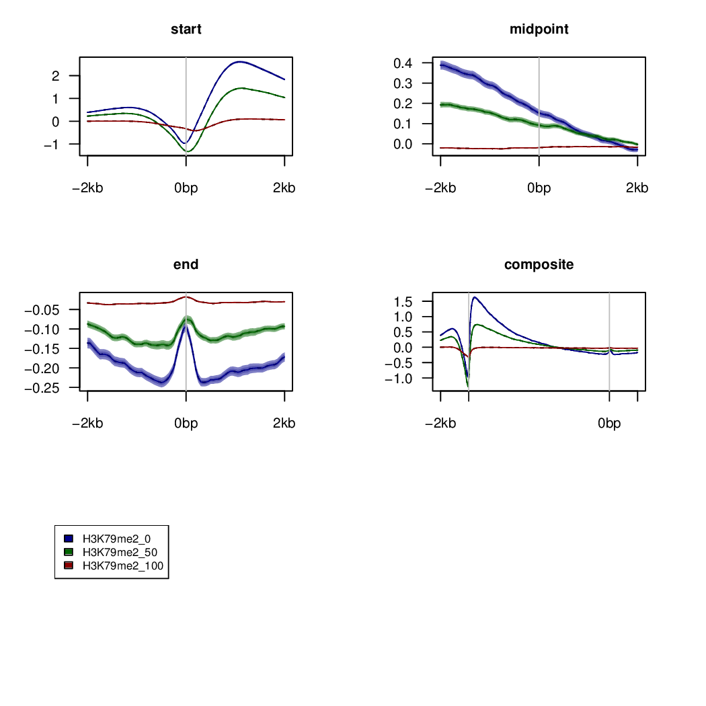 

*Solution figure 2*
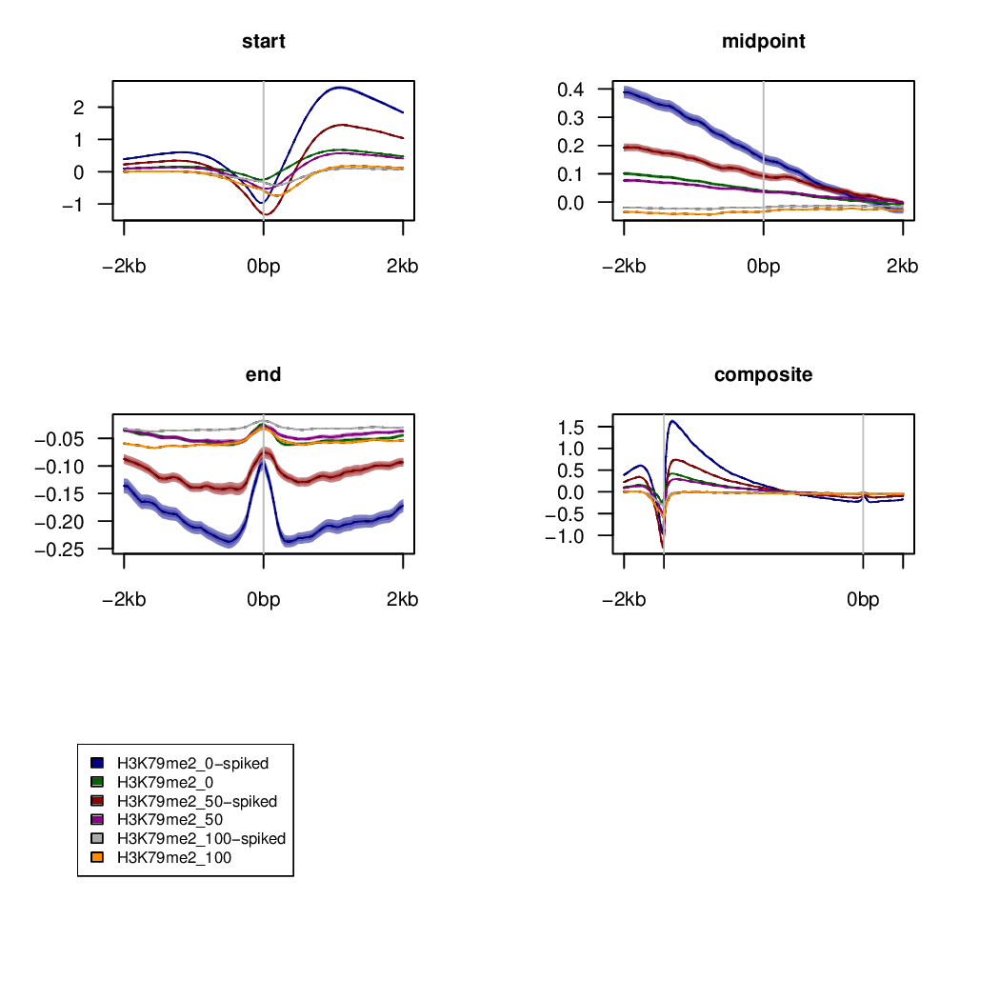


### IV-3 Visualization with heatmaps

plotHeatmaps is a versatile method based on the plotHeatmap method of the seqplots package (Stempor and Ahringer 2016). This method enables one to represent data at different locations (start, end, midpoint, composite) and at different stages of the normalization process. Different scaling (log, zscore, etc) and different clustering approaches (k-means, hierarchical, etc) can be used (see documentation for more details).

In this tutorial, only three different representations are tested to illustrate this function.


```{r packages, echo=TRUE,eval=FALSE,cache=FALSE}
## Heatmap of spiked H3K79me2 signal at TSS sorted by decreasing levels - figure 4
plotHeatmaps(csds_test, location = "start", transformType = "spiked", legend = TRUE, plot_scale = "no",sort_rows = "decreasing", nb_of_groups = 1, clustering_method = "none", include_exp_vec = NULL, auto_scale = FALSE)

## Corresponding heatmap of the raw data - figure 5
plotHeatmaps(csds_test, location = "start", transformType = "raw", legend = TRUE, plot_scale = "no",sort_rows = "decreasing", nb_of_groups = 1, clustering_method = "none", include_exp_vec = NULL, auto_scale = FALSE)

## Two groups k-means clustering of the spiked-in data - figure 6
plotHeatmaps(csds_test, location = "start", transformType = "spiked", legend = TRUE, plot_scale = "no",sort_rows = "decreasing", nb_of_groups = 2, clustering_method = "kmeans", include_exp_vec = NULL, auto_scale = FALSE)
```
*Solution figure 4*
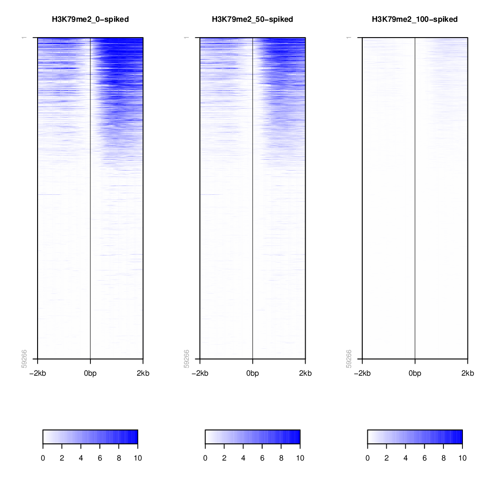

*Solution figure 5*
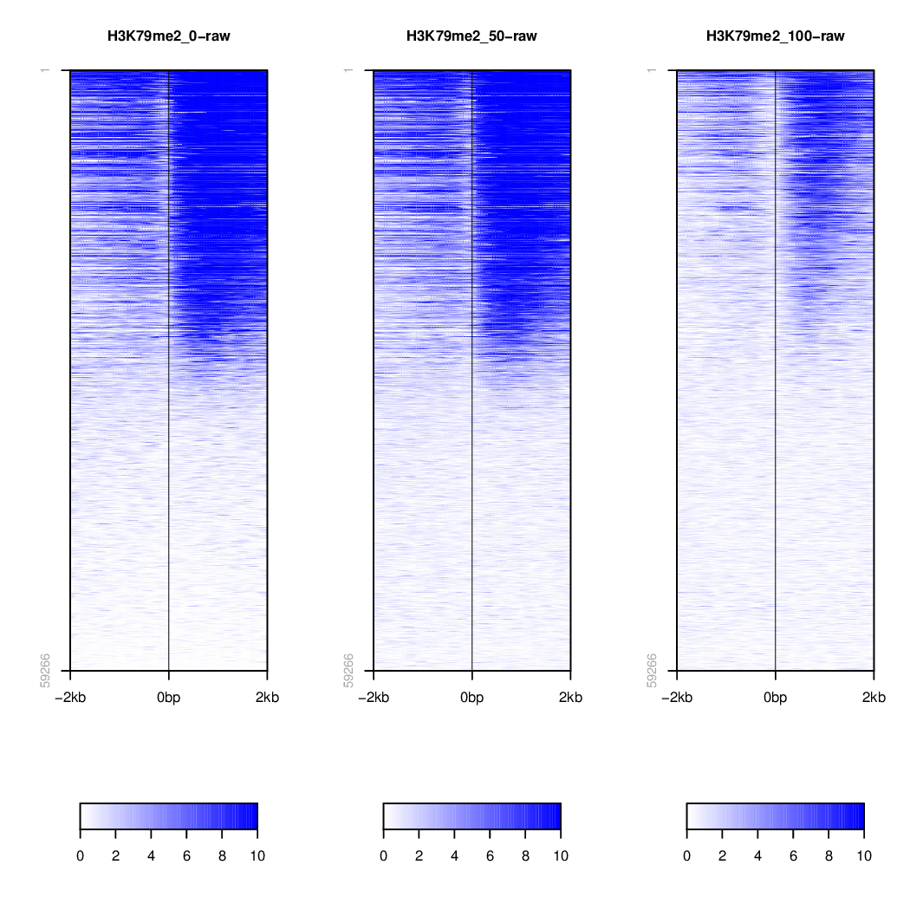

*Solution figure 6*
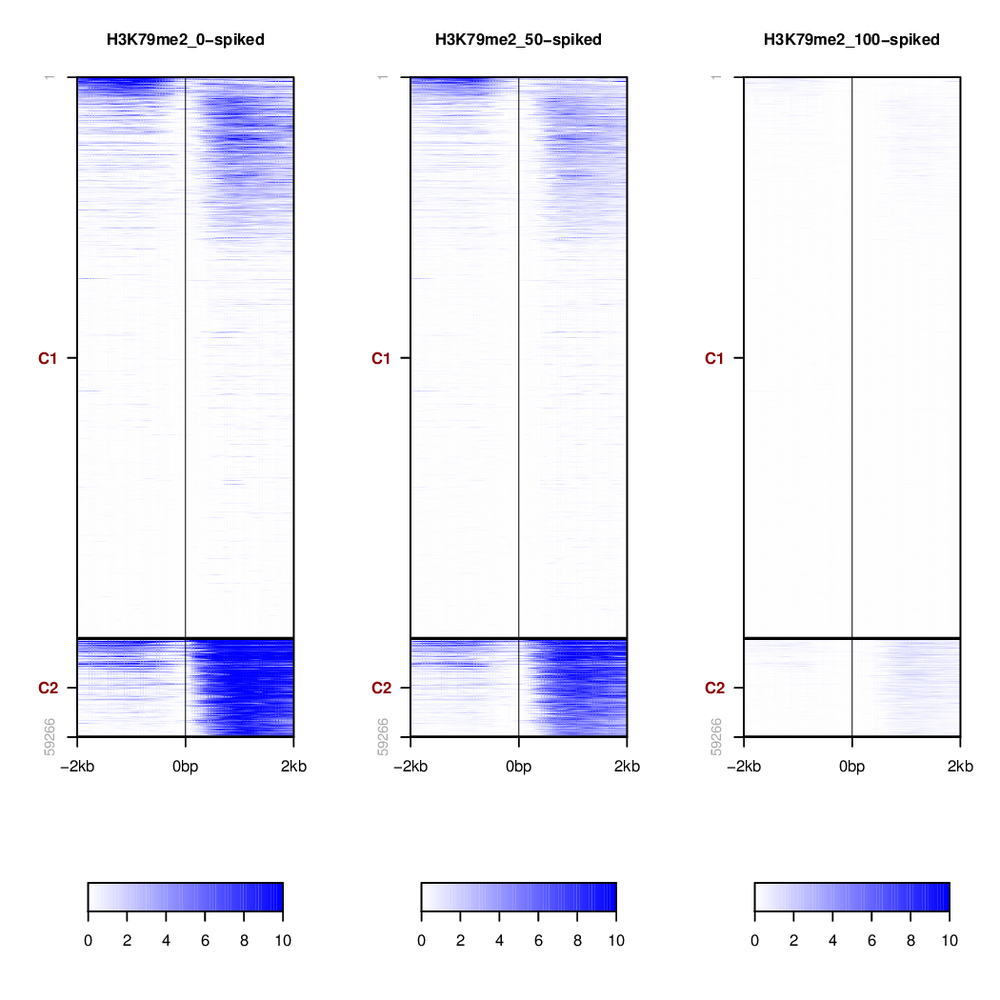


### IV-4 Visualization with Boxplots

'boxplotSpike' plots boxplots of the mean values of ChIP-seq experiments on the annotations given to the extractBinding method. It offers a wide range of graphical representations that includes violin plots (see documentation for details). 

```{r packages, echo=TRUE,eval=FALSE,cache=FALSE}
## Boxplot of the spiked-in data - figure 7
boxplotSpike(csds_test, outline = FALSE)

## Boxplot of the raw data - figure 8
boxplotSpike(csds_test,rawFile = TRUE, spiked = FALSE, outline=FALSE)

## Boxplot of all transformations - figure 9
boxplotSpike(csds_test,rawFile = TRUE, rpmFile = TRUE, bgsubFile = TRUE, revFile = TRUE, spiked = TRUE, outline = FALSE)
```

*Solution figure 7*
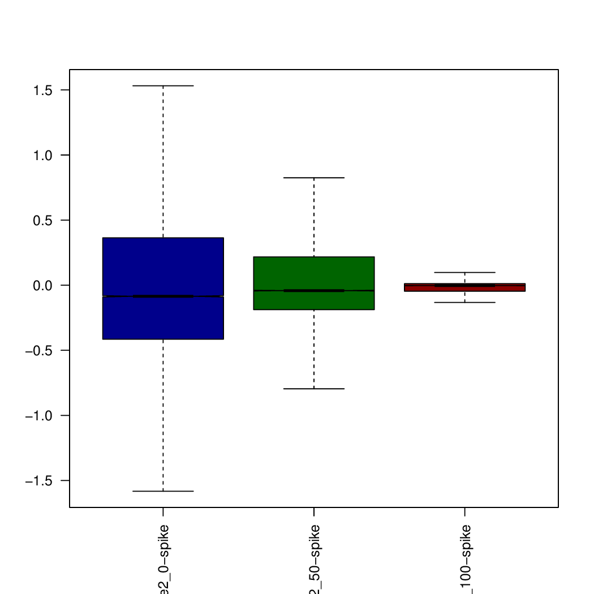

*Solution figure 8*
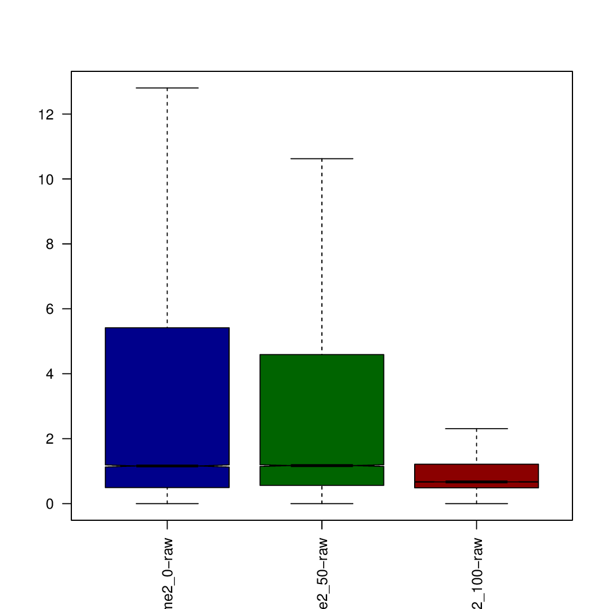

*Solution figure 9*
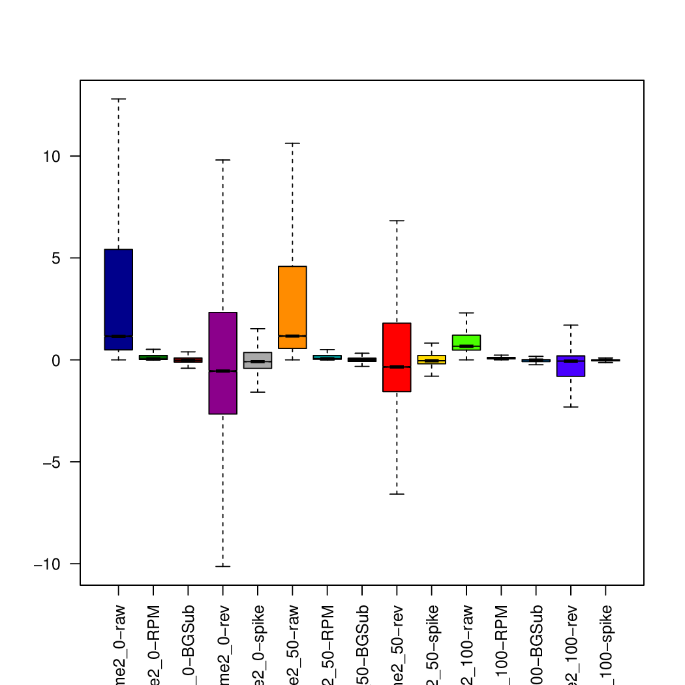


### IV-5 Visualization with correlation plots

The 'plotCor' method plots the correlation between ChIP-seq experiments using heatscatter plot or, if heatscatterplot = FALSE, correlation tables. For heatscatter plots, ChIPSeqSpike makes use of the heatscatter function of the package LSD and the corrplot function of the package corrplot is used to generate correlation tables. This offers a wide range of graphical possibilities for assessing the correlation between experiments and transformation steps (see documentation for more details).

```{r packages, echo=TRUE,eval=FALSE,cache=FALSE}
## Log transform correlation plot of spiked data with heatscatter representation - figure 10
plotCor(csds_test, rawFile = FALSE, rpmFile = FALSE,  bgsubFile = FALSE,  revFile = FALSE, spiked = TRUE,  main = "heatscatter",  method_cor = "spearman", add_contour = FALSE,  nlevels = 10,  color_contour = "black", method_scale = "log",  allOnPanel = TRUE, separateWindows = FALSE,  verbose = FALSE)

## Plot as above with raw data - figure 11
plotCor(csds_test, rawFile = TRUE, rpmFile = FALSE,  bgsubFile = FALSE,  revFile = FALSE, spiked = FALSE,  main = "heatscatter",  method_cor = "spearman", add_contour = FALSE,  nlevels = 10,  color_contour = "black", method_scale = "log",  allOnPanel = TRUE, separateWindows = FALSE,  verbose = FALSE)

## Correlation table comparing all transformations - figure 12
corr_matrix <- plotCor(csds_test, rawFile = TRUE, rpmFile = TRUE, bgsubFile = TRUE, revFile = TRUE, spiked = TRUE, heatscatterplot = FALSE, verbose = TRUE)
```

*Solution figure 10*
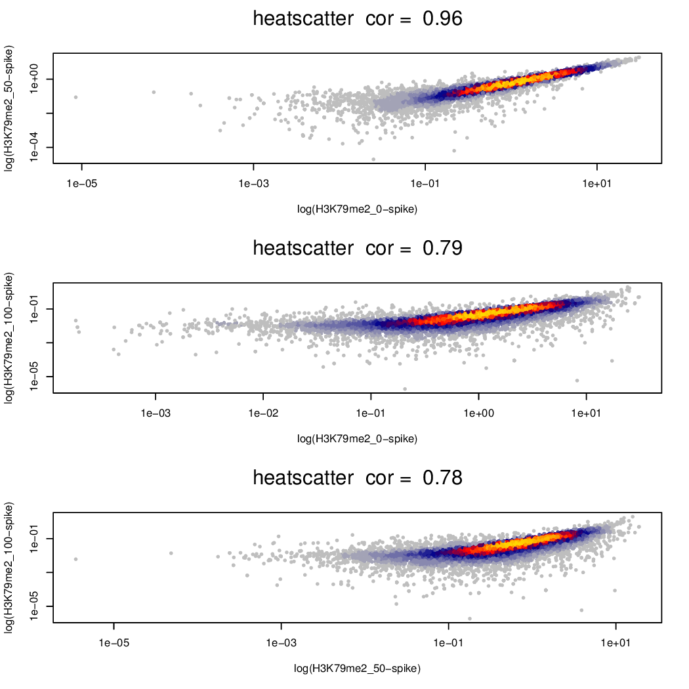

*Solution figure 11*
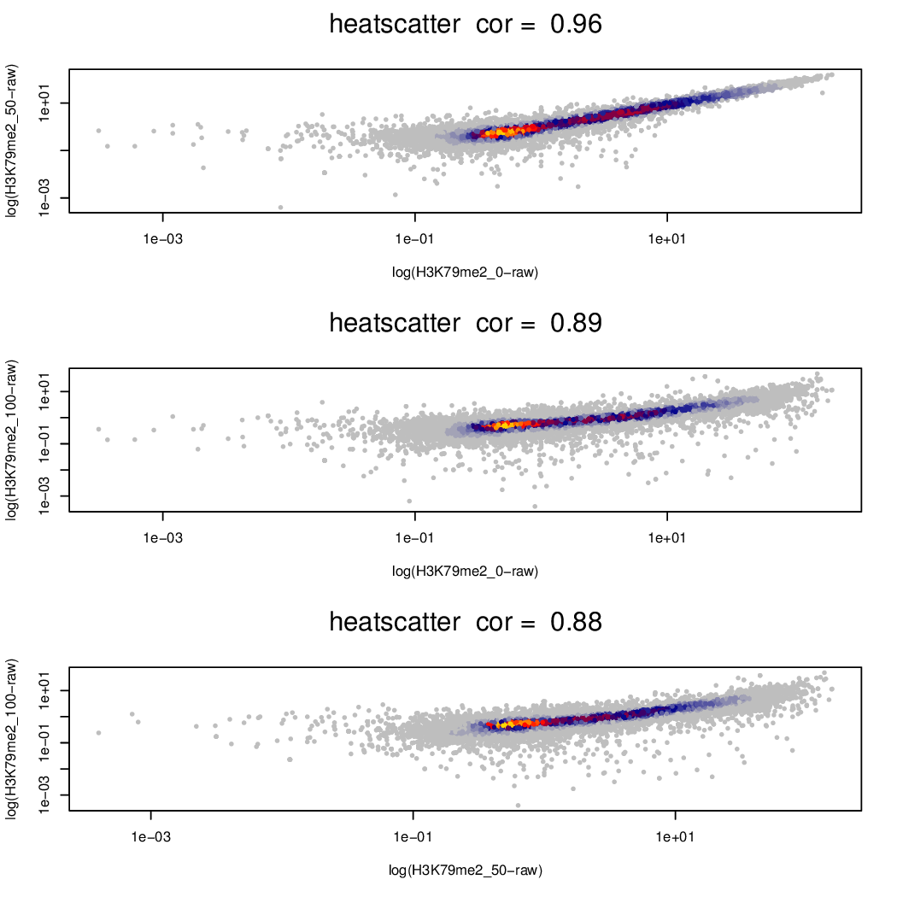

*Solution figure 12*
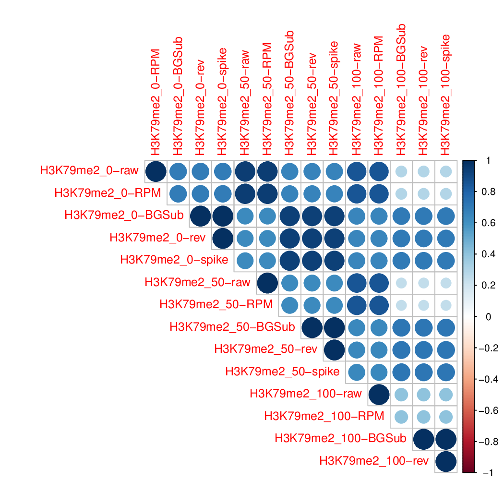


## Future developments

As indicated in the introduction, ChIPSeqSpike is a package at an early stage of development that is waiting its first release in the Bioconductor master branch.

The future developments will include:

- Providing a method to extract bed files from scaled bigwigs to perform peak calling for instance with MACS2.
- Providing pre-processing methods to perform a complete analysis.
- Providing diverse differential binding analysis solutions directly on the existing objects.
- Providing more visualization methods such as PCA and MA plots.
